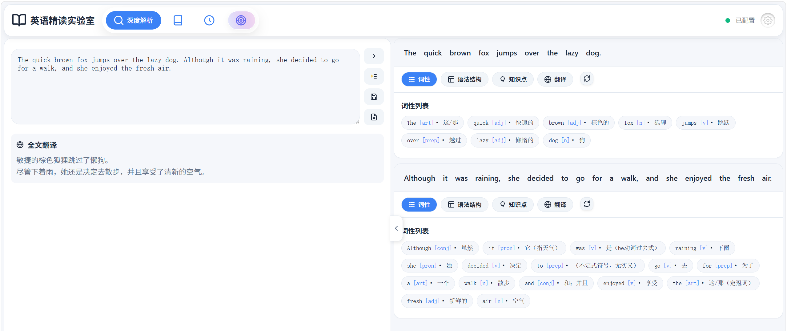

# 英研社 (English Study Club)

**文章驱动的人工智能英语精读学习工具** —— 阅读真实英文文章，AI 自动解析词性、语法、知识点与翻译，并通过闪卡、填空、听写、选词等练习模式，在语境中自然积累词汇与语法知识。

<p align="center">
  
</p>

<p align="center">
  <a href="https://fanqin314.github.io/english-study-club/"><strong>在线体验 Demo</strong></a> ·
  <a href="#快速开始">快速开始</a> ·
  <a href="#核心功能">核心功能</a> ·
  <a href="#技术架构">技术架构</a>
</p>

---

## 为什么是"文章驱动"？

传统背单词脱离语境，记住了单词却不会用。英研社让**一切学习围绕真实文章展开**：

1. 粘贴一篇英文文章，AI 逐句分析词性、语法结构、知识点并翻译
2. 阅读中随手标注生词，自动存入生词本
3. 用闪卡、填空、听写、选词、语境填空多种模式反复练习
4. 用全文回顾、逐句精读、生词测验进行阶段性复习
5. 学习统计追踪掌握度，个性化驱动复习计划

**阅读是第一优先级，学习功能融入阅读而非打断它。**

---

## 核心功能

### 人工智能深度解析
- **词性分析**：逐词标注词性并高亮（可自定义高亮配色）
- **语法结构**：解析句子成分与句型结构
- **知识点提取**：自动提炼值得记忆的语言点
- **逐句 + 全文翻译**：中文对照理解

### 记忆模式（4 种练习）
| 模式 | 说明 |
|---|---|
| 闪卡模式 | 翻转卡片，快速记忆单词 |
| 填空练习 | 语境填空，加深词汇理解 |
| 听写练习 | 听音拼写，强化听写能力 |
| 选词练习 | 释义 · 听音 · 选中文 · 填空，多维训练 |

### 复习模式（3 种方式）
- **全文回顾**：沉浸式重读原文，7 种阅读风格可切换（书本 / 杂志 / 报纸 / 可爱 / 像素 / 极简 / 典籍）
- **逐句精读**：逐句回看分析结果，细嚼慢咽
- **生词测验**：针对生词本出题，检验掌握度

### 词汇管理
- 多生词本管理，支持合并、删除、重命名
- 点击单词即时查词，右键菜单快捷操作
- 单词掌握度分级统计

### 数据与生态
- **本地文件夹持久化**：数据可保存到本地文件夹，浏览器清缓存也不丢失
- **JSON / TXT / MD 导出**：历史记录与生词本一键导出
- **浏览器插件 + Obsidian 插件**：网页划线、视频字幕采集进同一数据闭环
- **文件上传 / 图片 OCR / 拍照识别**：PDF、Word、图片文字一键导入

### 体验细节
- 暗色 / 浅色主题切换
- 全键盘快捷键（ESC 退出、Enter 提交）
- 响应式布局，桌面端与移动端均可使用
- 学习进度在模式卡片上实时可见

---

## 快速开始

### 在线体验（零配置）

直接访问 **https://fanqin314.github.io/english-study-club/** 即可使用。
项目内置默认 AI API Key，打开就能体验深度解析，无需任何配置。

### 本地运行

```bash
git clone https://github.com/fanqin314/english-study-club.git
cd english-study-club

# 方式一：直接用浏览器打开（纯静态应用，无需构建）
open index.html

# 方式二：本地静态服务器（推荐，避免 CORS 问题）
python -m http.server 8080
# 访问 http://localhost:8080
```

### 配置自定义 API（可选）

1. 点击右上角**设置**按钮
2. 填入 Base URL、API Key、模型名称
3. 保存后即可使用自己的 AI 服务（默认已内置可用的默认 Key）

---

## 技术架构

### 设计理念

- **纯前端**：无后端依赖，HTML + CSS + 原生 JavaScript（ES6+）
- **模块化架构**：ModuleRegistry 模块注册系统 + EventBus 事件总线，组件彻底解耦
- **可扩展**：新增功能只需创建模块 → 注册 → 接入 UI，不影响既有功能

### 目录结构

```
english-study-club/
├── index.html                 # 主页面（应用入口）
├── core/                      # 核心基础设施
│   ├── module_registry.js     # 模块注册系统
│   ├── event_bus.js           # 事件总线（模块通信）
│   ├── api_request.js         # AI API 请求（重试/缓存/错误处理）
│   ├── local_file_storage.js  # 本地文件夹持久化（File System Access API）
│   ├── security.js            # 安全与 API Key 处理
│   └── cache.js               # 解析结果缓存
├── features/                  # 业务功能模块
│   ├── deep_parse/            # 深度解析（词性/语法/知识点/翻译）
│   ├── memory_mode/           # 记忆与复习模式
│   ├── vocabulary/            # 生词本
│   ├── history/               # 历史记录
│   ├── file_upload/           # 文件上传 / OCR / 拍照
│   └── stats_tracker.js       # 学习统计
├── modules/                   # 业务逻辑模块
│   ├── analysis/              # 文章分析
│   └── dictionary/            # 词库服务
├── ui/                        # 界面层
│   ├── main_button.js         # 主按钮（深度解析/生词本/历史）
│   ├── event_delegation.js    # 事件委托
│   └── settings/              # 设置面板（API/主题/导出/存储）
└── assets/                    # 样式与静态资源（CSS 变量主题体系）
```

### 模块注册示例

```javascript
ModuleRegistry.register('MyModule', ['EventBus'], function (EventBus) {
    // 模块实现
    return { /* 公开接口 */ };
});
```

### 事件通信示例

```javascript
// 发送事件
EventBus.emit('analysis.completed', { articleId: 'xxx' });

// 监听事件
EventBus.on('analysis.completed', function (data) {
    // 处理
});
```

---

## 开发指南

### 添加新功能

1. 在 `features/` 下创建功能目录与 JS 文件
2. 通过 `ModuleRegistry.register()` 注册模块
3. 在 `index.html` 中添加 `<script>` 引用
4. 使用 `EventBus` 与既有模块通信

### 代码规范

- ES6+ 语法，JSDoc 注释
- UI 图标一律使用 SVG（禁止 emoji）
- 颜色统一走 CSS 变量（`assets/css/variables.css`），支持暗色模式
- 事件监听使用 `addEventListener` + `_cleanupFns` 清理，避免内存泄漏
- 交互元素需防重入保护

---

## 贡献指南

欢迎提交 Issue 和 Pull Request 改进项目。建议先阅读 [ARCHITECTURE.md](ARCHITECTURE.md) 了解模块化设计。

## 许可证

MIT License
